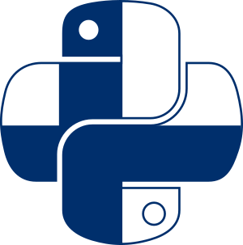
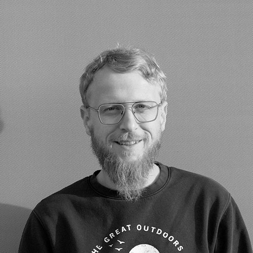
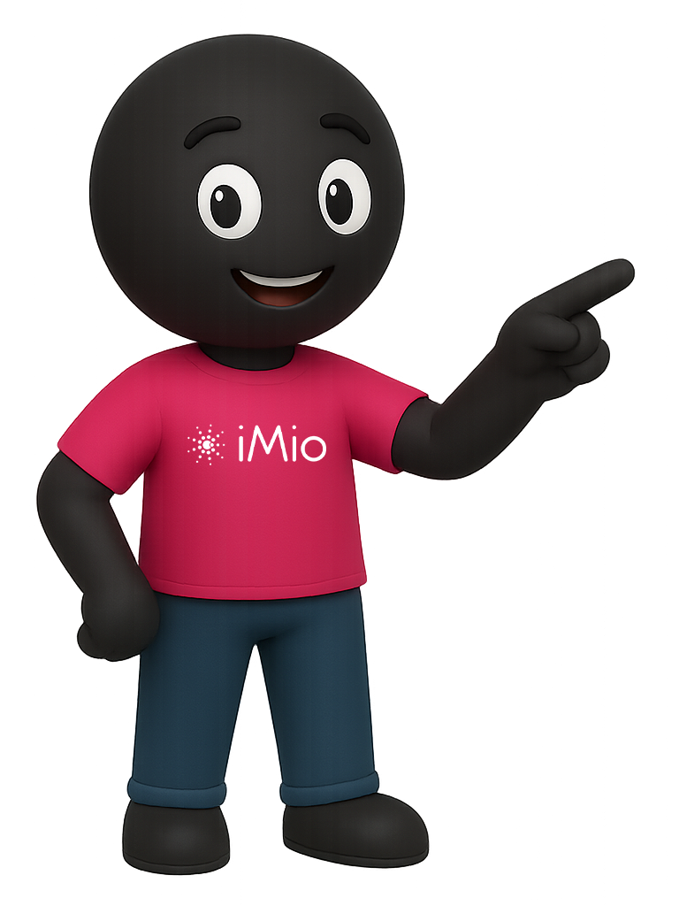
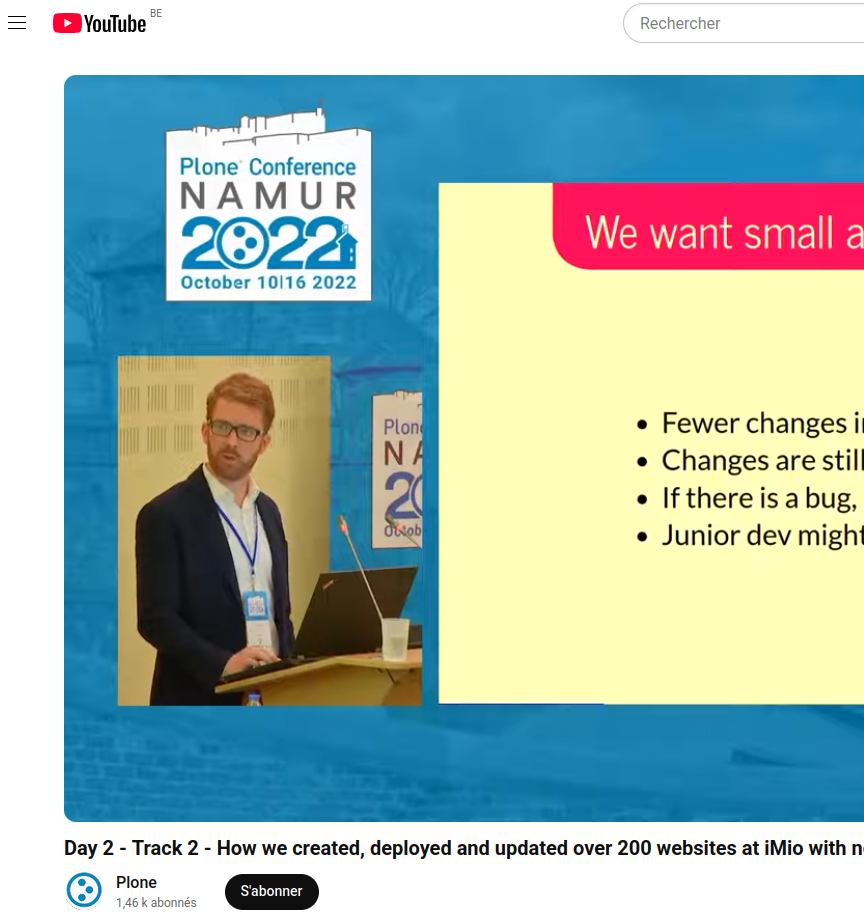
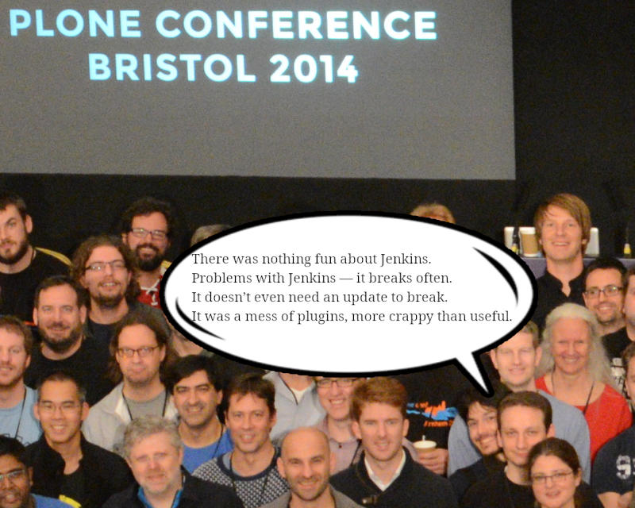
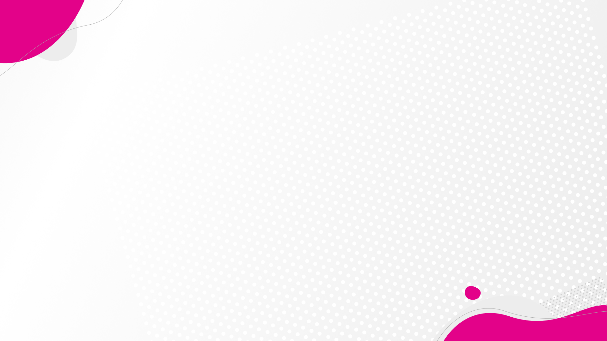
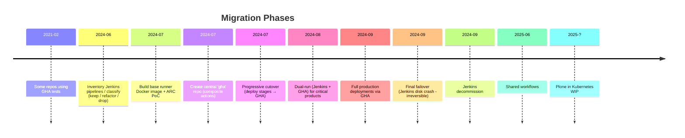
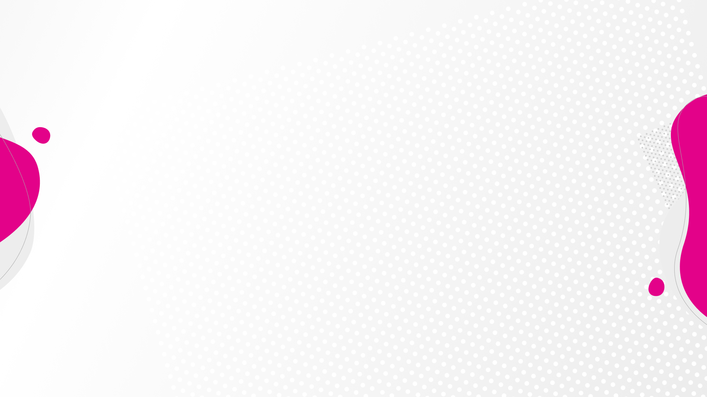

<style>
@import url('https://fonts.googleapis.com/css2?family=Quicksand:wght@300..700&display=swap');
</style>
<style>
section {
 font-family: "Quicksand", sans-serif;
}
.img-text-row-bio {
  display: flex;
  align-items: flex-start;
  gap: 24px;
}
.img-text-row-bio img {
  width: 128px;
  height: 128px;
  border-radius: 16px;
  object-fit: cover;
}
.img-text-row-bio .text {
  flex: 1;
}
.github-row {
  display: flex;
  align-items: center;
  gap: 12px;
  margin-top: 8px;
}
.github-row img {
  width: 32px;
  height: 32px;
  vertical-align: middle;
}
.github-row .username {
  font-size: 1.1em;
  font-weight: 500;
}
.img-text-row-imio {
  display: flex;
  align-items: flex-start;
  gap: 24px;
}
.img-text-row-imio img {
  width:35%;
  height:35%;
  border-radius: 16px;
}
.img-text-row-imio .text {
  flex: 1;
}
.img-fun-facts {
  position: absolute;
  top: 48px;
  left: 50%;
  transform: translateX(-50%);
  display: block;
  width: 90%;
  max-width: 90vw;
  height: auto;
  margin: 0 auto;
  border-radius: 18px;
  box-shadow: 0 4px 24px rgba(0,0,0,0.08);
}
.logo-row {
  display: flex;
  justify-content: center;
  align-items: center;
  gap: 40px;
  margin-top: 32px;
  margin-bottom: 24px;
}
.logo-row img {
  height: 128px;
  width: 128px;
  object-fit: contain;
  filter: drop-shadow(0 4px 16px rgba(0,0,0,0.10));
  background: white;
  border-radius: 12px;
  padding: 4px 6px;
  box-sizing: border-box;
}
</style>


# Jenkins Out, GitHub Actions In
### How We Made the Leap
(Plone-focused CI/CD modernization)


Lots of Plone products, one aging Jenkins box...
Time to evolve.

<div class="logo-row">
  
  
  
</div>

<!-- _footer: "" -->

---

## Who ?


### Benoît

<div class="img-text-row-bio">
  
  <div class="text">
    DevOps Engineer at iMio · 10+ years in Plone & open source<br>
    Automation, Docker, Kubernetes, IaC<br>
    Active Plone contributor
  </div>
</div>
<div class="github-row">
    
    <span class="username">bsuttor</span>
</div>

### Rémi

<div class="img-text-row-bio">
  
  <div class="text">
    16 years in municipal IT · SmartWeb @ iMio since 2022 <br>DevOps since 2024
    <br>Open-source & learning mindset
  </div>
</div>
<div class="github-row">
    
    <span class="username">remdub</span>
</div>

---


## iMio
<div class="img-text-row-imio">
  
  <div class="text">
    <ul>
    <li>Provides IT services to ~400 local authorities</li>
    <li>Municipalities, CPAS, provinces, police zones, rescue zones</li>
    <li>11 different applications → 1200+ instances</li>
    <li>Our mission: Mutualize IT solutions and support digitalization</li>
    </ul>
  </div>
</div>


---

## Agenda (25 min)

1. Context & Legacy Pain (3')
2. Why Migrate? (4')
3. Strategy & Process (5')
4. Technical Architecture (5')
5. Demo: Deployment Flow (4')
6. Tips, Fun Fact & Failures (2')
7. Future / WIP (2')

Q&A spills into hallway 🙂

---

### Throwback: PloneConf 2022



[How we created, deployed and updated over 200 websites at iMio with no downtime.](https://www.youtube.com/watch?v=z-5xx-vKYpc)

Key difference today:
- 2015: GitHub Actions did NOT exist
- Ecosystem maturity (2022 → 2025): composite actions, Action Runner Controler

---


## The Legacy Setup (Reality Check)

- Single physical server (Ubuntu 14.x)
- Jenkins + a lot of plugins
- Groovy pipelines of... varying quality
- Hard to upgrade (plugin dependency hell)
- Credential sprawl
- Snowflake state (deployed with iac, but not maintained anymore)

Risk ↑ / Confidence ↓ / Bus factor = 1.5

---




---

## Why Migrate? (High-Level)

- Consolidate around where code lives (GitHub)
- Align with Plone community practices
- Remove plugin fragility
- Horizontal scale via Kubernetes
- Isolation per job


---

## Why Not GitLab CI?

We already had GitLab internally BUT:
- All Plone products already on GitHub
- Would require migration, retraining, and changes on dev local setups (& minds 🤡)
- Marketplace ecosystem (actions)
- ARC (actions-runner-controller) maturity

Decision principle: minimize friction + follow upstream culture.

---

## Migration Timeline

TODO : plus fancy



<!-- ---

## Inventory & Rationalization

We catalogued every Jenkins job:
- xx total discovered
- xx obsolete (removed)
- xx merged (duplicates)
- xx rewritten from scratch
- xx migrated mostly as-is -->

---

## Talking to Teams

Questions we asked:

1. Does the actual workflow still suits your needs ?
2. How would you improve it ?


Qu'est-ce qui trigger quoi ? Est-ce toujours utile ?
Comment sont lancés les tests ? (buildout & co)
Quand et quels tags pour construire les images ?
etc
TODO

---

## Design Goals

- One mental model per repo (tests → build → deploy)
- Explicit environments: dev / staging / prod
- Idempotent deploy steps
- Reusable composite actions (gha repo)
- Deterministic runner image (pin dependencies)
- Observability

---

## The 'gha' Repository (Building Blocks)

TODO

Reusable composite actions (examples):
- setup-plone-environment
- run-plone-tests
- build-plone-image
- deploy-helm-release
- notify-mattermost (rate-limited)
- tag-and-publish (integrates zest.releaser conventions)

Link: https://github.com/IMIO/gha

Encapsulate complexity → keep workflows thin.

---

## Runner Strategy

Self-hosted via ARC:
https://github.com/actions/actions-runner-controller

Why:
- Auto-scaling ephemeral runners (security + cleanliness)
- Resource quotas per namespace
- Fast spin-up (prebaked image)
- Same network (reach internal services / servers)

---

## Runner Docker Image

Includes:
- Python (multiple versions)
- Plone buildout deps (C libs: libxml2, libjpeg, zlib...)
- Node.js
- caching dirs structured (/cache/buildout, pip)

Versioned & scanned (Trivy) → “infrastructure you can diff.”

---

## Branch / Deploy Flow (Visual)

### TODO (demo ?)
```mermaid
flowchart LR
    A[Dev Commit (feature/*)] -->|PR| B[Pull Request]
    B -->|Merge| C[dev branch]
    C -->|CI + Auto Deploy| D[Dev Sandbox]
    C -->|PR or Fast-Forward| E[main]
    E -->|CI + Immediate Deploy| F[Staging]
    E -->|Tag (zest.releaser)| G[(Tag vX.Y.Z)]
    G -->|Scheduled Deploy 03:00| H[Production]
    H -->|Post Deploy Checks| I[Notify + Metrics]
```

Consistent rules → reduces cognitive load.

---

## Environment Policy

Same as Jenkins:

- Dev: every merge to `dev` auto-deploys to specific sandbox instances
- Staging: every merge to `main` auto-deploys to staging instances (copy of some prod instances)
- Prod: only annotated tag on `main` + schedule (3 AM next day)
- Rollback: git tag revert + redeploy (immutable images retained)

---

## Rundeck Jobs (Legacy Tie-In)

Some long-running operations still in Rundeck:
- Docker images pull
- Instances reboot
- Upgrade-steps

GHA triggers via API (signed request)

---

## Observability

- Lightweight Mattermost notification: short status + link (no noisy full logs).
- Actions logs (raw) in GitHub web UI
- Plone logs : rundeck & Kibana
- Container-level metrics (Prometheus + Grafana)


Dashboard WIP

---

## Fun Fact (Timing Was Perfect)

Physical Jenkins server died (disk failure)
BEFORE migration completed.
No data salvage possible. (but not needed)
Migration ROI validated instantly 🙂

---

## Current WIP / Future

- Shared reusable workflows (org-level)
- Kubernetes-native Plone (full containerization & scaling)
- Align with [plone/meta] best practices (watching upstream)
- Dashboard replacing noisy Mattermost spam

---

## Conclusion

Migration is an opportunity to simplify, not just port.

---

## Resources

TODO : compléter 

- Actions Runner Controller
    https://github.com/actions/actions-runner-controller
- IMIO GHA composite actions
    https://github.com/IMIO/gha
- zest.releaser
    https://pypi.org/project/zest.releaser/
- ArgoCD
    https://argo-cd.readthedocs.io/

---

## Thank You

Questions?


<!-- END -->