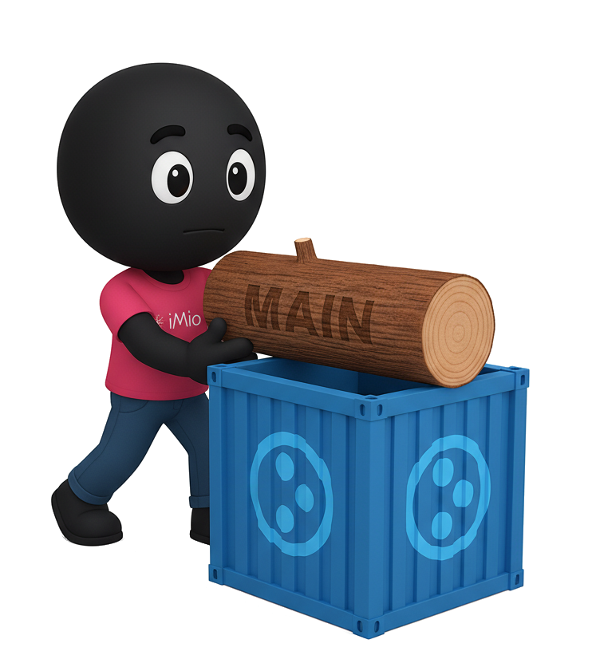
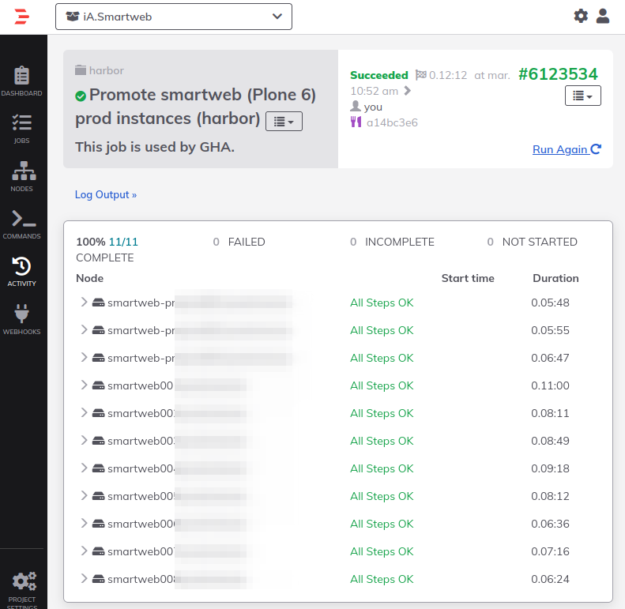
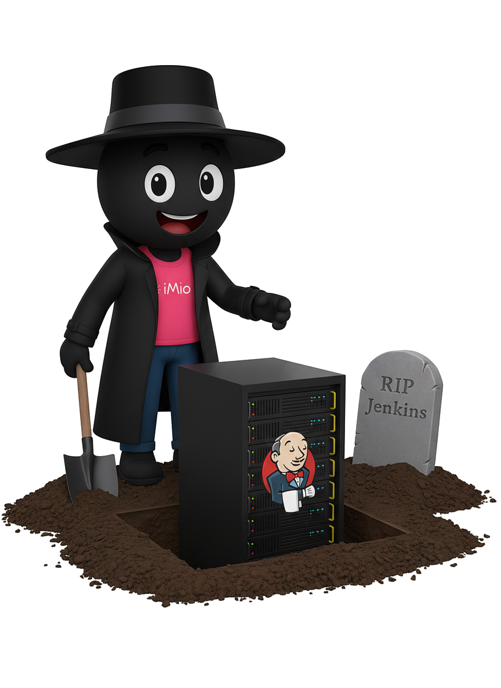

<!--
_footer: ""
_paginate: skip
_class: center bg8
-->

# Jenkins Out, GitHub Actions In
### How We Made the Leap

(Plone-focused CI/CD modernization)
Lots of Plone products, one aging Jenkins box...
Time to evolve.

  
  
  

<!--
  Thank you for being here. We are going to talk about our journey from Jenkins to Github actions.
-->

---
<!--
_class: bg10
-->

## Who ?

### Benoît

  
  

    DevOps Engineer at iMio · 15 years in Plone & open source 
    Automation, Docker, Kubernetes, IaC 
    Plone contributor, Plone foundation member
    

      
      bsuttor
    

  

### Rémi

  
  

    16 years in municipal IT · SmartWeb @ iMio since 2022  DevOps since 2024
     Open-source & learning mindset
    

      
      remdub
    

  

<!-- Benoît & Rémi-->

---
<!--
_class: bg5
-->

  
  

    <h2>What is iMio?</h2>
    <ul>
      <li>Public company in Belgium</li>
      <li>Provides IT services to ~400 local authorities</li>
      <ul>
        <li>Municipalities, Public Centre for Social Welfare, provinces, police zones, rescue zones</li>
      </ul>
      <li>11 different applications → 1200+ instances</li>
      <li>Python is in our DNA</li>
      <ul>
        <li>Plone, Odoo and Django projects</li>
      </ul>
      <li>Our missions</li>
      <ul>
        <li>Mutualise IT solutions</li>
        <li>Support digitalisation</li>
      </ul>
    </ul>
  

<!-- Rémi -->
---
<!--
_class: bg8
-->

  

  <h2>Agenda</h2>
    <ol>
      <li>Context & Legacy Pain</li>
      <li>Why Migrate?</li>
      <li>Strategy & Process</li>
      <li>Technical Architecture</li>
      <li>Demo: Deployment Flow</li>
      <li>Fun Fact</li>
      <li>Future / WIP</li>
    </ol>
  

  

<!-- Benoît -->
---

### Throwback: PloneConf 2022

<a href="https://www.youtube.com/watch?v=z-5xx-vKYpc">How we created, deployed and updated over 200 websites at iMio with no downtime.</a>

Key difference today:
- 2015: GitHub Actions did NOT exist
- Ecosystem maturity (2022 → 2025): composite actions, Action Runner Controler

<!-- Benoît
I made a talk 3 years ago about how we deployed our instances. We still used the same process, but no more the same tools
-->

---
<!--
_class: bg2
_footer: ""
-->

  
  

    <h2>The Legacy Setup</h2>
    <ul>
      <li>Single physical server (Ubuntu 14.x)</li>
      <li>Jenkins + a lot of plugins</li>
      <li>Groovy pipelines of... varying quality</li>
      <li>Hard to upgrade (plugin dependency hell)</li>
      <li>Credential sprawl</li>
      <li>Snowflake state (deployed with infrastructure as code, but not maintained anymore)</li>
    </ul>
    <h3>Risk ↑ / Confidence ↓ / Bus factor = 1.5</h3>
  

<!-- Benoît
With our old Jenkins server, we had a single physical server
I was the only one who maintained the server
-->

---
<!--
_class: bg5
_footer: ""
-->
 

<!-- Rémi
  When we told our sysadmins that we were doing a talk about Jenkins,
  Here was the reply of Cédric...
-->
---
<!--
_class: bg9
-->

  

    <h2>Why Migrate? (High-Level)</h2>
    <ul>
      <li>Jenkins server was on its last legs</li>
      <li>Consolidate around where code lives (GitHub)</li>
      <li>Align with Plone community practices</li>
      <li>Remove plugin fragility</li>
      <li>Horizontal scale via Kubernetes</li>
      <li>Isolation per job</li>
    </ul>
  

  

<!-- Rémi
  This brings us to the next slide about why migrate ?
-->
---
<!--
_class: bg7
-->

  
  

    <h2>Why Not GitLab CI?</h2>
    
We already had GitLab internally <b>BUT</b>

    <ul>
      <li>All Plone products already on GitHub</li>
      <li>Would require migration, retraining, and changes on dev local setups (& minds 🤡)</li>
      <li>Marketplace ecosystem (actions)</li>
      <li>ARC (actions-runner-controller) maturity</li>
    </ul>
  

<!-- Rémi 
  We had 2 obviouses choices. Github actions or gitlab-ci
  -->

---
<!--
_class: bg8
-->

## Timeline

<!-- Benoît
So in 2021 we started to use github actions on some repo for testing our code, as the community
in 2024, we have Jenkins, GHA and gitlab-ci in our infrastructure, we choose to remove one of these 3 ... This is the beginning of the end of Jenkins

https://www.mermaidchart.com/app/projects/ad5d26cc-69a9-4a3b-b625-7a64ef6c03e8/diagrams/7eb0a929-db20-4674-9341-dfd996eb8eaa/version/v0.1/edit
-->
<!--
timeline
    title Migration Phases
    2021-02: Some repos using GHA tests
    2024-06: Inventory Jenkins pipelines / classify (keep / refactor / drop)
    2024-07: Build base runner Docker image + ARC PoC
           : Create central 'gha' repo (composite actions)
           : Progressive cutover (deploy stages → GHA)
    2024-08: Dual-run (Jenkins + GHA) for critical products
    2024-09: Full production deployments via GHA
           : Jenkins decommission
    2025-06: Shared workflows
-->

---
<!--
_class: bg10
-->

## Talking to teams

  

    <h4>Questions we asked :</h4>
    <ul>
      <li>Does the actual workflow still suits your needs?</li>
      <ul>
            <li>What triggers the CI/CD ?</li>
      </ul>
      <li>How would you improve it?</li>
      <li>Should we keep explicit environments: staging / prod?</li>
      <li>Which metrics do you need?</li>
    </ul>
  

  

<!-- Benoît
One of the big part was to verify if our "old" deployement steps was still used and suits to our needs. We have some questions to ask to yourself

-->

---
<!--
_class: bg4
-->

  

    <h2>The 'gha' Repository</h2>
    
Reusable composite actions (examples)

    <ul>
      <li>Build and push a docker image</li>
      <li>Run plone tests</li>
      <li>Call Rundeck job</li>
      <li>Build deb package</li>
      <li>Release Helm Chart</li>
      <li>Notify on mattermost</li>
    </ul>
    <h3>Encapsulate complexity</h3>
    <h3>→ Keep workflows thin</h3>

  

  

<!-- Rémi
keep workflows thin and easy to understand
-->

---
<!--
_class: bg8
-->

  
  

    <h2>Runner Strategy</h2>
    <ul>
    <li>Self-hosted via ARC</li>
    <ul>
      <li>Auto-scaling ephemeral runners (security + cleanliness)</li>
      <li>Resource quotas per namespace</li>
      <li>Fast spin-up (prebaked image)</li>
      <li>Same network (reach internal services / servers)</li>
    </ul>
    </ul>
  

<!-- Rémi 
  We are hosting ourselve the runners and orchestrating them with the 
  action runner controler, so we can benefit from auto-scaling, and so on
-->
---
<!--
_class: bg4
-->

  

    <h2>Runner Docker Image</h2>
    <h4>Includes</h4>
    <a href="https://github.com/IMIO/docker-bases/tree/master/actions-runner" class="little-link">https://github.com/IMIO/docker-bases/actions-runner</a>
    <ul>
      <li>Python (multiple versions)</li>
      <li>Plone buildout deps (C libs: libxml2, libjpeg, zlib...)</li>
      <li>Caching dirs structured (/cache/buildout, pip)</li>
      <li>Versioned & scanned (Trivy)</li>
    </ul>
  

  

<!-- Benoît
We have now 3/4 differents actions runner images used depending on our needs
-->
---
<!--
_class: bg3 video
-->

  Branch / Deploy Flow
  

<!-- Benoît
Here we see what dev have to understand to deploy on app. We choose to use zest.releaser because we work with this package to release our eggs, so dev know and use often zest.releaser
Consistent rules → reduces cognitive load.
 -->

---
<!--
_class: bg10 video
_footer: ""
-->

<video controls>
  <source src="assets/rush1.mp4" type="video/mp4">
  Your browser does not support the video tag.
</video>

  Demo
  

<!-- Benoît & Rémi
Same as Jenkins:

- Staging: every merge to `main` auto-deploys to staging instances (copy of some prod instances)
- Prod: only annotated tag on `main` + schedule (3 AM next day)
- Rollback: git tag revert + redeploy (immutable images retained) (! Database)

-->

---
<!--
_class: bg5
-->

  

    <h2>Rundeck Jobs (Legacy Tie-In)</h2>
    <ul>
    <li>Some long-running operations still in Rundeck</li>
    <li>Docker images pull</li>
    <li>Instances reboot</li>
    <li>Upgrade-steps</li>
    <li>GHA triggers via Rest API</li>
    </ul>
  

  

<!-- Rémi
  As you saw on the demo, the last step is often a call to a rundeck job.
  This allows us to make operations needed to promote a new app version like images pull, instances reboot and so on.
  FYI, it will be deprecated when we will migrate to kube.
-->

---
<!--
_class: bg4
-->

  

    <h2>Observability</h2>
    <h4>Includes</h4>
    <ul>
    <li>Lightweight Mattermost notification: short status + link (no noisy full logs).</li>
    <li>Actions logs (raw) in GitHub web UI</li>
    <li>Plone logs : rundeck</li>
    <li>Container-level metrics (Prometheus + Grafana)</li>
    </ul>
  

  

<!-- Rémi
  During the process, we kept an eye to observability, with things like mattermost notifications, actions logs, plone logs, and so on.
-->

---
<!--
_footer: ""
_class: bg7
-->

  
  

    <h2>Fun Fact (Timing Was Perfect)</h2>
    <ul>
    <li>Physical Jenkins server died (disk failure)</li>
    <li><b>BEFORE</b> migration completed.</li>
    <li>No data salvage possible. (but not needed)</li>
    <li>Migration ROI validated instantly 🙂</li>
    </ul>
  

<!-- Benoît
One week before the end of migration, one disk crash on your old OVH server (11 years) not able to recover

-->

---
<!--
_class: bg8
-->

  

    <h2>Current WIP / Future</h2>
    <ul>
    <li>Shared reusable workflows (org-level)</li>
    <li>Kubernetes-native Plone (full containerization & scaling)</li>
    <li>Align with [plone/meta] best practices</li>
    <li>Dashboard replacing noisy Mattermost spam</li>
    </ul>
  

  

<!-- Benoît & Rémi-->

---
<!--
_class: center bg6 vcenter
_footer: ""
-->

  
  

    
      Farewell Jenkins, you won’t be missed.
    
  

<!-- Benoît & Rémi -->

---
<!--
_class: bg10
-->

  

    
      Thank you
    
     
    
      Any question?
    
    
Feel free to scan the QR-Code to download the slides

  

  

<!-- Benoît & Rémi -->

---
<!--
_class: bg1
-->
# Resources
- iMio: https://www.imio.be
- iMio GHA composite actions: https://github.com/IMIO/gha
- iMio runner docker image base: https://github.com/IMIO/docker-bases/tree/master/actions-runner
- Actions Runner Controller: https://github.com/actions/actions-runner-controller
- zest.releaser: https://pypi.org/project/zest.releaser/
- ArgoCD: https://argo-cd.readthedocs.io/

<!-- END -->