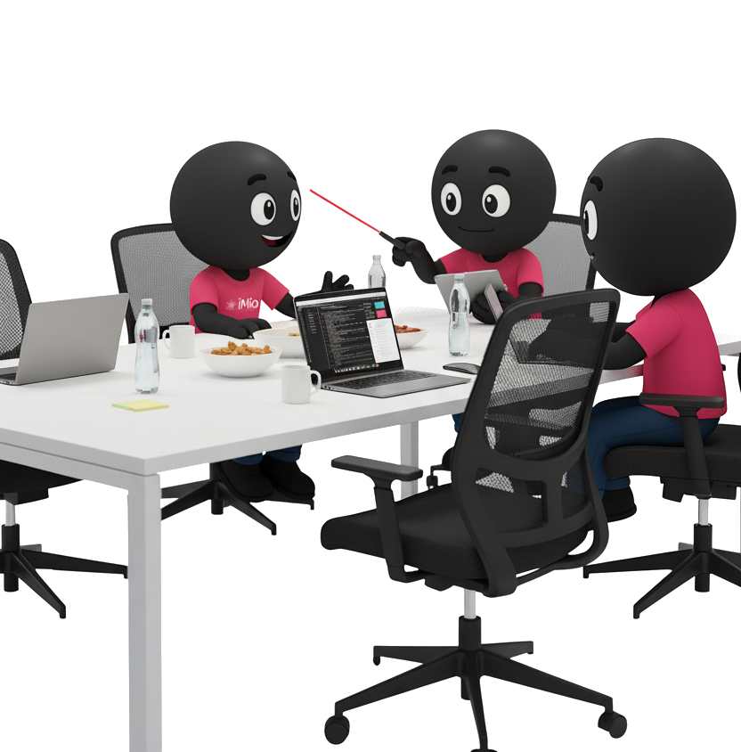

<!--
_footer: ""
_paginate: skip
_class: center
-->

# Jenkins Out, GitHub Actions In
### How We Made the Leap

(Plone-focused CI/CD modernization)
Lots of Plone products, one aging Jenkins box...
Time to evolve.

  
  
  

---

## Who ?

### Benoît

  
  

    DevOps Engineer at iMio · 15 years in Plone & open source 
    Automation, Docker, Kubernetes, IaC 
    Plone contributor, Plone foundation member
    

      
    bsuttor

  

### Rémi

  
  

    16 years in municipal IT · SmartWeb @ iMio since 2022  DevOps since 2024
     Open-source & learning mindset
    

    
    remdub

  

<!-- Benoît & Rémi-->

---

## iMio

  
  

    <ul>
      <li>Public company in Belgium</li>
      <li>Provides IT services to ~400 local authorities</li>
      <ul>
        <li>Municipalities, CPAS, provinces, police zones, rescue zones</li>
      </ul>
      <li>11 different applications → 1200+ instances</li>
      <li>Python is in our ADN</li>
      <ul>
        <li>Plone, Odoo and Django projects</li>
      </ul>
      <li>Our missions</li>
      <ul>
        <li>Mutualize IT solutions</li>
        <li>support digitalization</li>
      </ul>
    </ul>
  

<!-- Rémi -->
---

## Agenda (25 min)

  

    <ol>
      <li>Context & Legacy Pain (3')</li>
      <li>Why Migrate? (4')</li>
      <li>Strategy & Process (5')</li>
      <li>Technical Architecture (5')</li>
      <li>Demo: Deployment Flow (4')</li>
      <li>Tips, Fun Fact & Failures (2')</li>
      <li>Future / WIP (2')</li>
    </ol>
  

  

<!-- Benoît -->
---

### Throwback: PloneConf 2022

<a href="https://www.youtube.com/watch?v=z-5xx-vKYpc">How we created, deployed and updated over 200 websites at iMio with no downtime.</a>

Key difference today:
- 2015: GitHub Actions did NOT exist
- Ecosystem maturity (2022 → 2025): composite actions, Action Runner Controler

<!-- Benoît -->

---

## The Legacy Setup (Reality Check)

  
  

    <ul>
      <li>Single physical server (Ubuntu 14.x)</li>
      <li>Jenkins + a lot of plugins</li>
      <li>Groovy pipelines of... varying quality</li>
      <li>Hard to upgrade (plugin dependency hell)</li>
      <li>Credential sprawl</li>
      <li>Snowflake state (deployed with iac, but not maintained anymore)</li>
    </ul>
    <h3>Risk ↑ / Confidence ↓ / Bus factor = 1.5</h3>
  

<!-- Benoît -->

---

<!-- Rémi -->
---

## Why Migrate? (High-Level)

  

    <ul>
      <li>Jenkins server was on its last legs</li>
      <li>Consolidate around where code lives (GitHub)</li>
      <li>Align with Plone community practices</li>
      <li>Remove plugin fragility</li>
      <li>Horizontal scale via Kubernetes</li>
      <li>Isolation per job</li>
    </ul>
  

  

<!-- Rémi -->
---

## Why Not GitLab CI?

We already had GitLab internally BUT:
- All Plone products already on GitHub
- Would require migration, retraining, and changes on dev local setups (& minds 🤡)
- Marketplace ecosystem (actions)
- ARC (actions-runner-controller) maturity

Decision principle: minimize friction + follow upstream culture.

<!-- Rémi -->

---

## Timeline

<!-- Benoît
https://www.mermaidchart.com/app/projects/ad5d26cc-69a9-4a3b-b625-7a64ef6c03e8/diagrams/7eb0a929-db20-4674-9341-dfd996eb8eaa/version/v0.1/edit
<!--
timeline
    title Migration Phases
    2021-02: Some repos using GHA tests
    2024-06: Inventory Jenkins pipelines / classify (keep / refactor / drop)
    2024-07: Build base runner Docker image + ARC PoC
           : Create central 'gha' repo (composite actions)
           : Progressive cutover (deploy stages → GHA)
    2024-08: Dual-run (Jenkins + GHA) for critical products
    2024-09: Full production deployments via GHA
           : Jenkins decommission
    2025-06: Shared workflows
-->

---

## Talking to Teams

  
  

    <h4>Questions we asked :</h4>
    <ol>
    <li>Does the actual workflow still suits your needs ?</li>
    <li>How would you improve it ?</li>
    <li>Qu'est-ce qui trigger quoi ? Est-ce toujours utile&nbsp;?</li>
    <li>Comment sont lancés les tests? (buildout & co)</li>
    <li>Quand et quels tags pour construire les images&nbsp;?</li>
    <li>etc</li>
    <li>TODO</li>
    </ol>
  

---

## Design Goals

  

    <h4>Questions we asked :</h4>
    <ul>
      <li>One mental model per repo (tests → build → deploy)</li>
      <li>Explicit environments: dev / staging / prod</li>
      <li>Idempotent deploy steps</li>
      <li>Reusable composite actions (gha repo)</li>
      <li>Deterministic runner image (pin dependencies)</li>
      <li>Observability</li>
    </ul>
  

  

---

## The 'gha' Repository

Reusable composite actions (examples):
- Build and push a docker image
- Run plone tests
- Build deb package
- Release Helm Chat
- Notify on mattermost

Link: https://github.com/IMIO/gha

### Encapsulate complexity 
### → Keep workflows thin.

<!-- Rémi -->

---

## Runner Strategy

  
  

    <h4>Self-hosted via ARC</h4>
    <ul>
    <li>Auto-scaling ephemeral runners (security + cleanliness)</li>
    <li>Resource quotas per namespace</li>
    <li>Fast spin-up (prebaked image)</li>
    <li>Same network (reach internal services / servers)</li>
    </ul>
  

https://github.com/actions/actions-runner-controller

<!-- Rémi -->
---

## Runner Docker Image

  

    <h4>Includes</h4>
    <a href="https://github.com/IMIO/docker-bases/tree/master/actions-runner">https://github.com/IMIO/docker-bases/tree/master/actions-runner</a>
    <ul>
      <li>Python (multiple versions)</li>
      <li>Plone buildout deps (C libs: libxml2, libjpeg, zlib...)</li>
      <li>caching dirs structured (/cache/buildout, pip)</li>
      <li>Versioned & scanned (Trivy)</li>
    </ul>
  

  

<!-- Benoît -->
---

Branch / Deploy Flow

  

    
  

<!-- Benoît
Démo ?
Consistent rules → reduces cognitive load.
 -->

---

## Environment Policy

Same as Jenkins:

- Staging: every merge to `main` auto-deploys to staging instances (copy of some prod instances)
- Prod: only annotated tag on `main` + schedule (3 AM next day)
- Rollback: git tag revert + redeploy (immutable images retained) (! Database)

<!-- Benoît -->

---

## Rundeck Jobs (Legacy Tie-In)

Some long-running operations still in Rundeck:
- Docker images pull
- Instances reboot
- Upgrade-steps

GHA triggers via Rest API

<!-- Rémi -->

---

## Observability

  

    <h4>Includes</h4>
    <ul>
    <li>Lightweight Mattermost notification: short status + link (no noisy full logs).</li>
    <li>Actions logs (raw) in GitHub web UI</li>
    <li>Plone logs : rundeck & </li>
    <li>Container-level metrics (Prometheus + Grafana)</li>
    <li>Dashboard WIP</li>
    </ul>
  

  

<!-- Rémi -->

---

## Fun Fact (Timing Was Perfect)

  
  

    <ul>
    <li>Physical Jenkins server died (disk failure)</li>
    <li>BEFORE migration completed.</li>
    <li>No data salvage possible. (but not needed)</li>
    <li>Migration ROI validated instantly 🙂</li>
    </ul>
  

<!-- Benoît -->

---

## Current WIP / Future

- Shared reusable workflows (org-level)
- Kubernetes-native Plone (full containerization & scaling)
- Align with [plone/meta] best practices (watching upstream)
- Dashboard replacing noisy Mattermost spam

<!-- Benoît & Rémi-->

---

## Conclusion

Migration is an opportunity to simplify, not just port.
todo

<!-- Benoît & Rémi -->

---

## Thank you

- Actions Runner Controller: https://github.com/actions/actions-runner-controller
- IMIO GHA composite actions: https://github.com/IMIO/gha
- zest.releaser: https://pypi.org/project/zest.releaser/
- ArgoCD: https://argo-cd.readthedocs.io/
- Our slides: https://imio.github.io/ploneconf2025_from_jenkins_to_gha/

## Questions ?

<!-- END -->